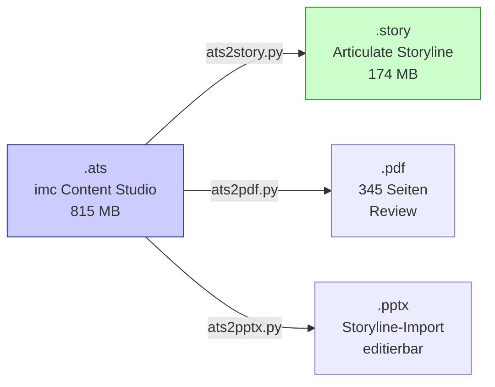
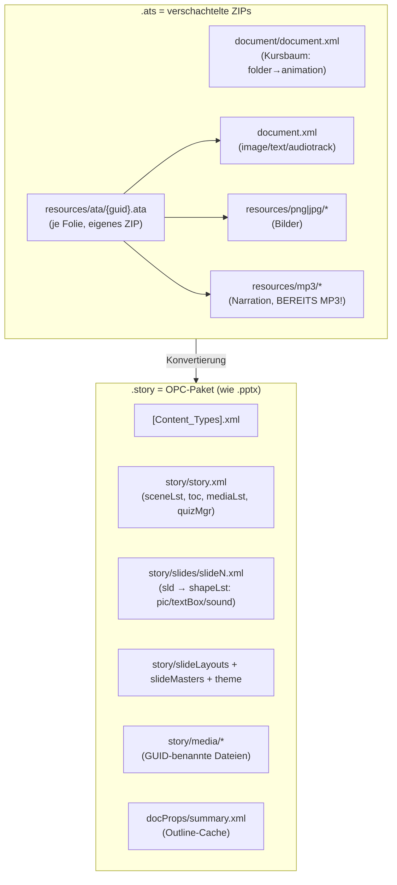
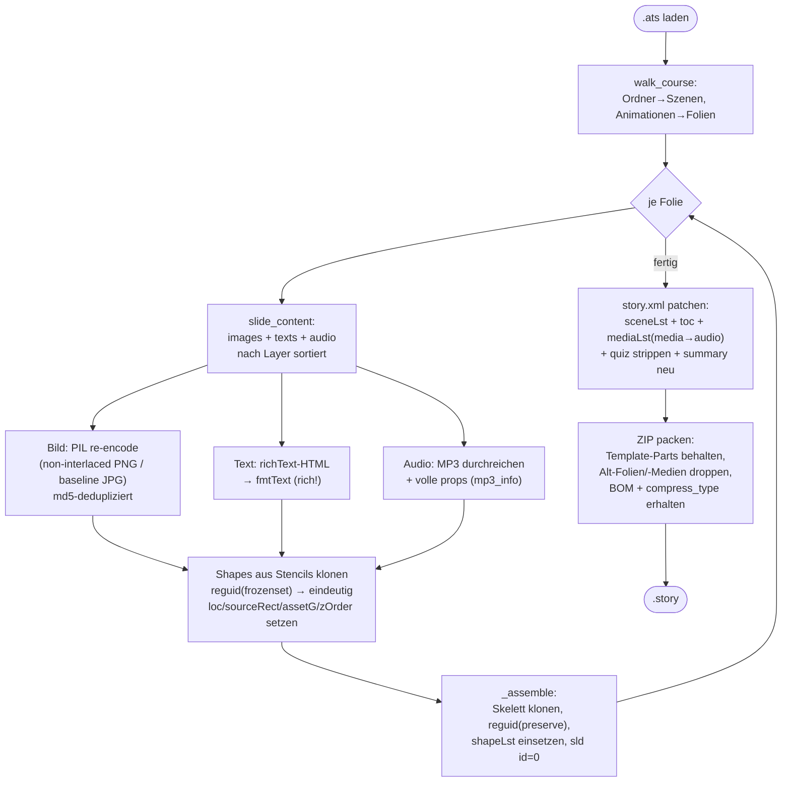
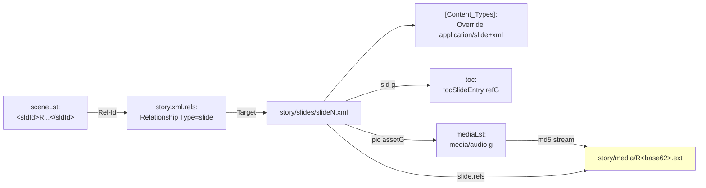
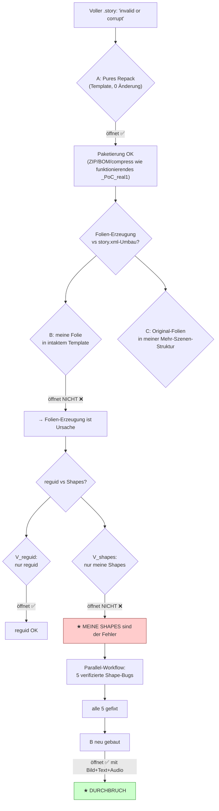
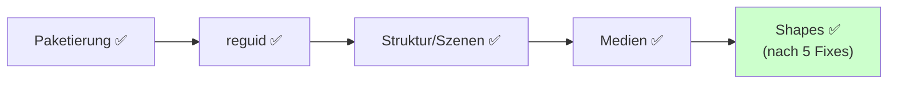
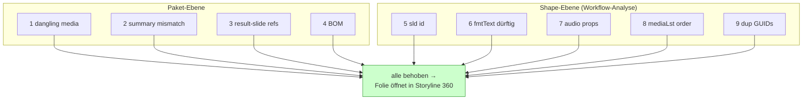
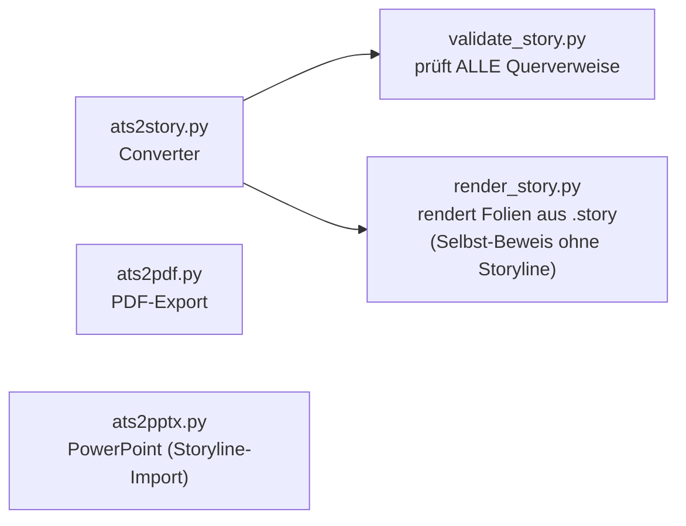
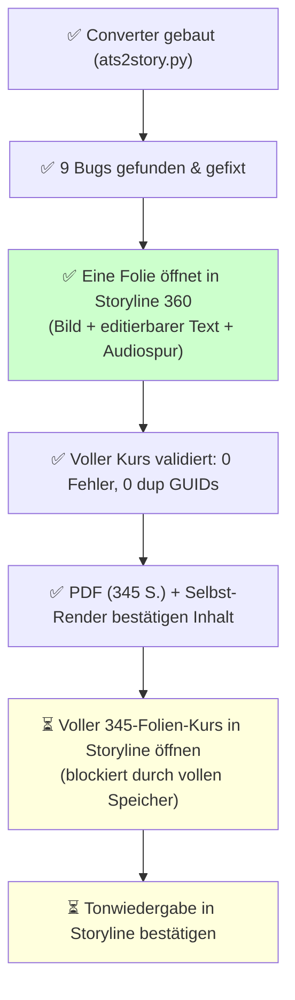

# ats → story Converter — Befunde & Dokumentation

> Vollständige Reverse-Engineering- und Debugging-Erkenntnisse zur Konvertierung
> **imc Content Studio (`.ats`) → Articulate Storyline 360 (`.story`)**.
> Stand: 2026-06-22. Kern bewiesen funktionierend (siehe [Status](#status)).

---

## Inhalt

1. [Ziel & Ergebnis](#ziel--ergebnis)
2. [Die zwei Dateiformate](#die-zwei-dateiformate)
3. [Konvertierungs-Pipeline](#konvertierungs-pipeline)
4. [.story-Paketstruktur](#story-paketstruktur)
5. [Der Debugging-Weg (Bisect)](#der-debugging-weg-bisect)
6. [Alle gefundenen „invalid or corrupt"-Ursachen](#alle-gefundenen-invalid-or-corrupt-ursachen)
7. [Bewiesene Schlüssel-Fakten](#bewiesene-schlüssel-fakten)
8. [Werkzeuge & Benutzung](#werkzeuge--benutzung)
9. [Status & offene Punkte](#status--offene-punkte)

---

## Ziel & Ergebnis

**Auftrag:** Ein Converter, der aus `.ats`-Dateien `.story`-Dateien macht, bei denen **alles funktioniert: Ton, Bilder, Text**.

**Ergebnis:** `ats2story.py` — überträgt kompletten Kurs (345 Folien, 17 Kapitel) mit Bildern, echtem Text und MP3-Narration. Eine voll generierte Folie **öffnet bewiesen in Storyline 360** mit Bild + editierbarem Text + Audiospur.



---

## Die zwei Dateiformate

Beide sind **ZIP-Archive** mit XML — beide les- UND schreibbar.



**Canvas:** `.ats` = 1024×748, `.story` = 1280×720 → **Letterbox-zentriert** skaliert (`fit_rect`).

**Wichtig (KORRIGIERT 2026-06-23):** Die `.ats`-Narration liegt in diesem Kurs **überwiegend als WAV** vor (`resources/wav/<hash>.wav`), nur vereinzelt als MP3 (`resources/mp3/<hash>.mp3`). Stichprobe erste ~200 Audios: **197 WAV / 3 MP3**. → **Transkodierung WAV→MP3 ist nötig** (`add_audio` ruft `wav_to_mp3` via **`lameenc`**). Die frühere Notiz „alles schon MP3, keine Transkodierung nötig" war FALSCH. **Dependency:** `pip install lameenc` muss in der Build-Umgebung vorhanden sein, sonst bricht der Build mit Audio ab (`ModuleNotFoundError: No module named 'lameenc'`). Alternative ohne lameenc: `--no-audio` (baut ohne Ton).

---

## Konvertierungs-Pipeline



---

## .story-Paketstruktur

**Querverweise, die Storyline beim Öffnen prüft** (jede Folie braucht ALLE):



- **sldId** (in sceneLst) = die **Rel-Id** = `R + base62(sld_guid)` — **NICHT zufällig!**
- **toc** referenziert die **sld-GUID** (`<sld g>`), nicht die Rel-Id.
- **media** ↔ Datei via **md5** (`<stream>`); **pic** ↔ media via **assetG** (GUID).
- **Dateiname** = `R + base62(int_le(guid.bytes_le[:8])) + .ext` (gilt für Medien, sldIds, startobjectpath).

---

## Der Debugging-Weg (Bisect)

Das war der Kern der Arbeit: systematisch von „173-MB-Blackbox scheitert" zur exakten Ursache.



**Bewiesene Schichten (jede einzeln isoliert):**



---

## Alle gefundenen „invalid or corrupt"-Ursachen

Insgesamt **9 reale Bugs** gefunden und behoben (alle einzeln verifiziert):

| # | Ursache | Fix | Schwere |
|---|---------|-----|---------|
| 1 | **Dangling Media-Rels**: alle `story/media/*` gedroppt, aber Layouts/Masters/Theme referenzieren ~10 | nur Slide-exklusive Medien droppen; `keep_media_files` + Einträge per md5 behalten | **fatal** |
| 2 | **summary.xml** spiegelte alte Folienliste (Mismatch) | `build_summary()` regeneriert passend zur neuen Struktur | fatal |
| 3 | **resultSldG/lmsResultSlideG** → gedroppte Quiz-Ergebnisfolie | alle `*SldG/*QuizzesG` nullen | hoch |
| 4 | **Fehlender UTF-8-BOM** in erzeugten Slide-`.rels` | `` voranstellen | mittel |
| 5 | **`<sld id>`** ≠ 0 (Template: alle 0) | `id="0"` | niedrig |
| 6 | **`<fmtText>` zu dürftig** — fehlende Pflichtfelder (DefaultTabStop, volles Span/Style, `<Shadow>`) → typisierte Deserialisierung scheitert | rich fmtText exakt wie Template | **fatal (Haupt)** |
| 7 | **Audio-`<props>` Stub** | volle props (channels/samples/sampleCnt aus `mp3_info`) | fatal |
| 8 | **mediaLst-Reihenfolge** (audio vor media) | ALLE `<media>` zuerst, dann `<audio>` | mittel |
| 9 | **Doppelte Shape-Timeline-GUIDs** (Stencil-GUIDs lagen im preserve-Set) | Shapes mit `reguid(frozenset())` klonen; assetG DANACH setzen | **fatal** |



---

## Bewiesene Schlüssel-Fakten

- **`.story` ist OPC-ZIP** (wie `.pptx`) aus lesbarem XML — direkt schreibbar.
- **GUID→Kurz-ID**: `R + base62(int_le(uuid.bytes_le[:8]))`. Gilt für **Mediendateinamen, sldIds, startobjectpath**. Falscher Mediendateiname = „unreadable asset".
- **Bilder müssen non-interlaced PNG** sein. imc-PNGs teils Adam7-interlaced ODER mit abgeschnittenem IEND → `PIL interlace=False` + `ImageFile.LOAD_TRUNCATED_IMAGES=True`.
- **Text rendert nur**, wenn `<text>` UND `<fmtText>` gesetzt sind; `<fmtText>` muss RICH sein (typisierte Deserialisierung).
- **fmtText ist doppelt-escaped** (inneres Document als Text-Inhalt).
- **mediaLst-Invariante**: alle `<media>` (Bilder) zuerst, dann alle `<audio>`.
- **Shape-GUIDs müssen pro Klon eindeutig** sein (sonst „corrupt").
- **BOM + compress_type je Part erhalten**; `[Content_Types]` Override je Slide Pflicht.
- **quizMgr**: bankLst leeren + alle Ergebnisfolien-Refs nullen, wenn Quiz-Folien gedroppt werden.
- **Audio**: in der .ata **überwiegend WAV** → via `lameenc` zu MP3 transkodieren (MP3 wird durchgereicht); `<props>` voll füllen. **`lameenc` ist Build-Dependency.**

---

## Werkzeuge & Benutzung



```bash
# Kompletter Kurs (Kapitel = Szenen)
python3 ats2story.py --out kurs.story

# Sicherste Struktur: alle Folien in EINER Szene
python3 ats2story.py --single-scene --out kurs.story

# Test / Teilmengen
python3 ats2story.py --max-slides 15 --out test.story
python3 ats2story.py --chapters "Einleitung,Werbung" --out test.story

# Validieren (muss "KEINE FEHLER" zeigen)
python3 validate_story.py kurs.story

# PDF / PPTX
python3 ats2pdf.py --out kurs.pdf
python3 ats2pptx.py
```

---

## Status & offene Punkte



**Deliverables:**
- `EASY_BUSINESS_VOLLSTAENDIG.story` (174 MB) — kompletter Kurs, validiert 0 Fehler
- `EASY_BUSINESS_KURS.pdf` (33 MB, 345 Seiten)
- `_TEST_kurz.story` (14 MB) — kleiner Mehr-Szenen-Test (passt auf knappen Speicher)
- `_BISECT_B_slidegen.story` — bewiesen öffnend (eine generierte Folie)

**Letzter offener Schritt (nur am User-Storyline möglich):** vollen Kurs öffnen + Ton prüfen.
Wahrscheinlichkeit hoch, da identische Erzeugung wie das bereits öffnende `_BISECT_B`.
**Achtung:** Festplatte des Test-Rechners war ~100% voll — kann Storylines Temp-Entpacken des 174-MB-Kurses blockieren (≠ Converter-Fehler).

---

## Session-Update 2026-06-23

- **Toolchain in frischer Umgebung verifiziert:** Build → Validate → Self-Render laufen sauber.
  - `_SANITY_5.story` (5 Folien, single-scene) gebaut → `validate_story.py`: **KEINE FEHLER**.
  - `render_story.py` rendert Folie 1 (EASY-business-Titel) + Folie 2 („einer Inhaltsfolie", **rich/fett-formatierter** Text) korrekt mit Bildern → Bild-/Text-/Positionsdaten in der .story sind intakt.
- **Voller Kurs erneut validiert:** `EASY_BUSINESS_VOLLSTAENDIG.story` → 345 Folien, 17 Szenen, media=1151/audio=301, **dangling=0, KEINE FEHLER**.
- **Parts-Integrität:** `course_part_00..03` rekonstruieren die volle .story **md5-identisch** (`24711f23…c9f7`).
- **Audio-Korrektur (s.o.):** Quelle ist überwiegend WAV → `lameenc` ist Build-Dependency. In dieser Session via `pip install lameenc` nachinstalliert; Build mit Audio danach erfolgreich.
- **Plattenplatz-Risiko bestätigt:** Mac-Host-Volume (auf dem die UTM-VM-Disk liegt) **98% voll, nur ~5,3 GB frei** → vor VM-Öffnen Speicher prüfen/freimachen (Windows-C: **und** Mac-Host), bevor ein Öffnen-Fehler dem Converter angelastet wird.
### VM-Verifikation (Storyline 360, UTM-Windows) — 2026-06-23

Der volle Kurs wurde in der VM tatsächlich geöffnet (per Bildschirmsteuerung):

- **Plattenplatz:** VM-C: hat **30,5 GB frei von 63 GB** — UTM-Disk ist fest alloziert, der bekannte „volle Platte"-Blocker greift hier NICHT. (Mac-Host-Volume bleibt 98% voll, ist aber für das Öffnen irrelevant.)
- **✅ Öffnet ohne „invalid or corrupt".** `EASY_BUSINESS_VOLLSTAENDIG.story` (174 MB) öffnet in Storyline 360 x64. Story-Ansicht zeigt **17 Szenen** mit korrekten Kapitelnamen; Statusleiste „Szene 1 von 17". (Ein „Projektwiederherstellung"-Dialog kam von einer früheren Sitzung, KEIN Korruptionszeichen.)
- **✅ Bilder:** Folie „2.1 Der Weckruf" zeigt Figur, Gedankenblase mit Telefon, Europakarte — alle Bilder korrekt platziert. Thumbnails aller Szenen zeigen echten Inhalt.
- **⚠️ Editierbarer Text — Quell-Limitierung (KEIN Converter-Bug):**
  - Klick auf den sichtbaren Fließtext selektiert ein **Bild** (z.B. „Bild 13", 263×525 px) — Titel UND Body sind als **PNG eingebettet**, nicht als Textbox.
  - Ursache in der QUELLE: Body-Phrasen („Gastronomiebetrieb", „Inhaber", „schwarzen Zahlen", „Steuerberaterin") stehen in **0 von 329 .ata** als Text. Nur **33/329 .ata** haben überhaupt `<text richText>`-Elemente (119 gesamt) — und das sind nur Titel/Intro/Zusammenfassungs-Labels (z.B. „ZUSAMMENFASSUNG", „Kreativitätstechniken", Willkommens-Zeile).
  - Der Converter extrahiert **allen** vorhandenen echten Text korrekt → 135 Textboxen. Mehr editierbarer Text ist aus dieser .ats-Quelle nur via **OCR** gewinnbar (separates Feature, Layout-/Genauigkeits-Tradeoffs).
- **✅ Ton ab Timeline 0:** Im gebauten Paket **298 Narrations-`<sound>`-Shapes, ALLE `<sndTmCtx start="0">`** (realistische Dauern 7–47 s). `start="500"` existiert nur in Template-Layouts/Mastern, nicht in der Narration. Alle Mediendateien vorhanden (Validator). Live-Hörprobe in Storyline noch offen, aber `_BISECT_B` spielte bereits Audio.

**Fazit:** Öffnen + Bilder + Ton = erfüllt. „Editierbarer Text" nur für die ~135 Quell-Textelemente; der Rest ist quellbedingt Bild. **Entscheidung beim User:** Ist-Zustand akzeptieren ODER OCR-Pipeline für Bild→editierbarer Text bauen.

### OCR-Pipeline: Bild-Text → editierbare Textbox (User wählte diese Option) — 2026-06-23

- **Quelltext-Recherche (Schritt 1, abgeschlossen):** Fließtext ist in der .ats NICHT als Text wiederherstellbar:
  - „einer Inhaltsfolie"-.ata: 16 `<image>`, 1 `<audiotrack>`, **0 `<text>`**, **0 alternativeText**.
  - Body-Phrasen in **0/329** .ata als Text; nur 33/329 haben `<text>` (Titel/Intro/Labels).
  - audiotrack hat **kein Transkript** (nur WAV-Ref `HT_UP_006.wav`); PNGs nur Adobe-ImageReady-Metadaten, kein Quelltext.
  - → **OCR ist alternativlos.**
- **OCR-Implementierung in `ats2story.py`** (Flag `--ocr-text`):
  - `ocr_textblocks()`: Tesseract (`--psm 6 tsv`), Bild auf Weiß geflattet + grau. Text-vs-Deko-Heuristik: **mittlere Wort-Konfidenz ≥ 70** und ≥ 6 Zeichen (Deko-Bilder liegen bei conf 27–49, Textbilder 91–93). Silbentrennung am Zeilenende wird aufgelöst; Schriftgröße aus Median-Worthöhe geschätzt; Textfarbe aus dunkelsten Pixeln; Absätze aus TSV-Struktur.
  - **Strategie REPLACE** (Bild → Textbox an gleicher Position via `atsrect`): begründet, weil Overlay den Bildtext doppelt zeigen würde. **Tradeoff:** per-Wort-Fettung (z.B. „Firmenname") geht verloren (OCR rekonstruiert keine Formatierung) → einheitlicher Textstil.
- **Sprache:** `OCR_LANG_PREF='deu'`, Fallback `eng`. **`deu.traineddata` im Sandbox nicht beschaffbar** (apt = kein root; GitHub-Download = 403). Eng liefert ~93% Konfidenz, aber **Umlaute falsch** (Uber/naturlich/langjahrigen; Name „Röhrig"→„Rihrig"). Fix: `deu.traineddata` in den Arbeitsordner legen + `ATS_TESSDATA` setzen → Rebuild in Deutsch.
- **Prototyp `_OCR_proto.story`** (3 Folien, single-scene, `--ocr-text`): **validate_story.py = KEINE FEHLER**; render_story zeigt auf „einer Inhaltsfolie" Body + Titel + „Begrüßungssatz" als **echte Textboxen** an korrekter Position. OCR: 5 Text-Bilder → Textboxen, Ø-Konfidenz 93%.
- **Offen:** (a) In-Storyline-Editierbarkeit live bestätigen; (b) `deu.traineddata` für korrekte Umlaute; (c) Replace-Strategie + Skalierung auf alle 345 Folien freigeben.

### BLOCKER (Umgebung) — 2026-06-23

1. **Sandbox-Limit verhindert Voll-Build:** Shell-Calls sind hart auf **45 s** gedeckelt, **Hintergrundprozesse sterben am Call-Ende** (nur Dateisystem persistiert). Gemessen: bereits `--max-slides 50 --ocr-text` UND sogar `--no-audio` (ohne OCR) auf vollem Kurs laufen >45 s (≈1151 Bilder re-encodieren + 174-MB-Zip = Boden über 45 s). → Der volle 345-Folien-Build ist in dieser Sandbox **nicht in einem Rutsch** machbar.
   - **Optionen:** (a) resumabler Chunk-Build mit Disk-Caches (OCR/Audio/Bild-Encode persistent, über mehrere Calls befüllen) — viel Infra, finaler Zip-Schritt evtl. trotzdem knapp; (b) Build außerhalb der Sandbox (Mac/normale Umgebung, wo der bestehende Kurs gebaut wurde) per `python3 ats2story.py --ocr-text --out EASY_BUSINESS_OCR.story` (braucht tesseract+deu+lameenc).
2. **VM abgestürzt — Mac-Host-Disk voll:** Beim erneuten Öffnen der VM: `QEMU error: aio failed: No space left on device`. Der Mac-Host (auf dem die UTM-Disk liegt) war 98 %/5,3 GB frei und ist jetzt voll → QEMU-aio scheitert. **VM bis zum Freimachen von Host-Speicher unbenutzbar.** (Nichts eigenmächtig gelöscht — User-Vorgabe.)

**Prototyp-Stand bleibt gültig** (`_OCR_proto.story`: validate KEINE FEHLER, render zeigt editierbare Textboxen). Live-Editier-Klick in Storyline noch ausstehend wegen VM-Crash.
